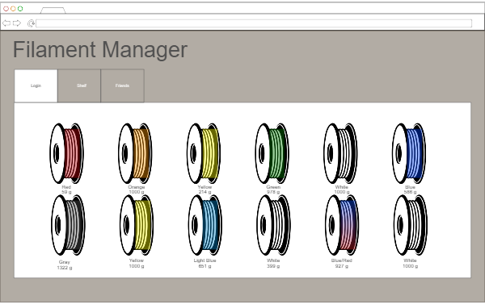
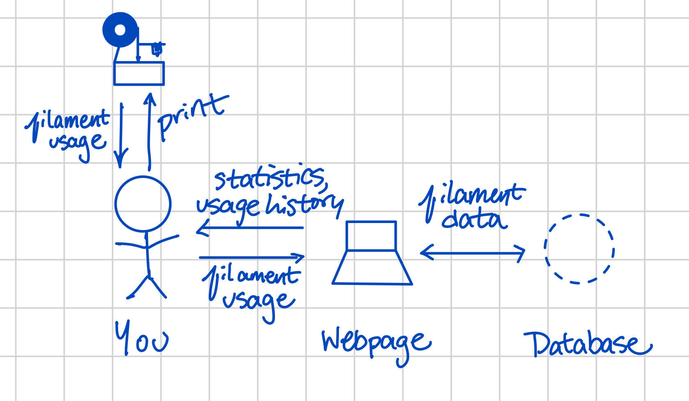

# Filament Minder

[My Notes](notes.md)

As a 3D printing enthusiast, I often switch between different filament types and colors to best fit my usage. I might print using flexible TPU filament to print a phone case, and then switch to yellow to print a model of a banana. Many filament spools include a feature that allows you to estimate how much filament you have left, but it isn't easy to use and only provides an estimate. Filament minder aims to fix that! I will be creating a website that keeps track of all of your rolls of filament and how much is left on each roll.

## 🚀 Specification Deliverable
[This](https://github.com/webprogramming260/startup-example/blob/main/README.md) is a great example.

For this deliverable, I did the following. I checked the box `[x]` and added a description for things I completed.

- [x] Proper use of Markdown
- [x] A concise and compelling elevator pitch: I updated the elevator pitch to include a pitch for my webpage.
- [x] Description of key features: I added some key features that I want my webpage to include.
- [x] Description of how you will use each technology: I discussed how I will use each of the units of the class on my website. 
- [x] One or more rough sketches of your application: I added a sketch of the website, and I added a sketch of all of the interactions that lead to a successful website.

### Elevator pitch

Are you tired of not knowing if you have enough filament to complete the cool 3D print you found? Imagine starting a print you are super excited about, only to have the filament run out right before the print finishes. Do you leave it on your printer until the new filament roll arrives? Do you waste the filament you had left? Luckily, with Roll Call, you can avoid this predicament entirely!

Roll Call is an easy-to-use website that tracks your filament so you don't have to! It allows you to track the amount of filament left on each roll (including color, brand, type, and cost), log print history, and manage your filament stores. 

Don't wait until you ruin another print, let Roll Call take attendance, you focus on creating the next big thing!

### Design

Above is a sketch of what my webpage might look like, created using [ninjamock.com](https://ninjamock.com/home/index). Once you log in, the home page will show the rolls of filament that you have included, and you can select them, read the usage rates, what it was used for, etc. Below is a diagram showing how a user would interact with the webpage, server, and the physical world. 

### Key features

- Secure Login
- Data storage connected to your account
- Ability to add rolls of filament, specifying Brand, color, starting amount, type, price, etc.
- Ability to add print mass to update the roll, with a name for the print for recording
- Ability to see a history of prints for each roll
- Display all of the rolls, with a status bar showing how much has been used/is left
- If time: the ability to predict the cost of a print based on the cost of the roll and the starting amount

### Technologies
I am going to use the required technologies in the following ways.

- **HTML** - Used for the main structure of the webpage. Has 4 pages: Login, dashboard, a roll page, and statistics (amount spent per month, total amount used, etc.). If time, I will add a fifth page for print cost prediction. 
- **CSS** - Styling that looks good on any size device. Good use of color, spacing, and design elements.
- **React** - Login, display your rolls of filament, adding prints to a roll of filament.
- **Service** - Add roll, update roll, get roll history, share roll.
- **DB/Login** - Store users, rolls of filament, and related information in the database. Account creation is in use, and all data is securely saved.
- **WebSocket** - Ability to recommend a roll of filament, also potential to add friends and compare filament usage.

## 🚀 AWS deliverable

For this deliverable I did the following. I checked the box `[x]` and added a description for things I completed.

- [ ] **Server deployed and accessible with custom domain name** - [My server link](https://yourdomainnamehere.click).

## 🚀 HTML deliverable

For this deliverable I did the following. I checked the box `[x]` and added a description for things I completed.

- [ ] **HTML pages** - I did not complete this part of the deliverable.
- [ ] **Proper HTML element usage** - I did not complete this part of the deliverable.
- [ ] **Links** - I did not complete this part of the deliverable.
- [ ] **Text** - I did not complete this part of the deliverable.
- [ ] **3rd party API placeholder** - I did not complete this part of the deliverable.
- [ ] **Images** - I did not complete this part of the deliverable.
- [ ] **Login placeholder** - I did not complete this part of the deliverable.
- [ ] **DB data placeholder** - I did not complete this part of the deliverable.
- [ ] **WebSocket placeholder** - I did not complete this part of the deliverable.

## 🚀 CSS deliverable

For this deliverable I did the following. I checked the box `[x]` and added a description for things I completed.

- [ ] **Header, footer, and main content body** - I did not complete this part of the deliverable.
- [ ] **Navigation elements** - I did not complete this part of the deliverable.
- [ ] **Responsive to window resizing** - I did not complete this part of the deliverable.
- [ ] **Application elements** - I did not complete this part of the deliverable.
- [ ] **Application text content** - I did not complete this part of the deliverable.
- [ ] **Application images** - I did not complete this part of the deliverable.

## 🚀 React part 1: Routing deliverable

For this deliverable I did the following. I checked the box `[x]` and added a description for things I completed.

- [ ] **Bundled using Vite** - I did not complete this part of the deliverable.
- [ ] **Components** - I did not complete this part of the deliverable.
- [ ] **Router** - Routing between login and voting components.

## 🚀 React part 2: Reactivity

For this deliverable I did the following. I checked the box `[x]` and added a description for things I completed.

- [ ] **All functionality implemented or mocked out** - I did not complete this part of the deliverable.
- [ ] **Hooks** - I did not complete this part of the deliverable.

## 🚀 Service deliverable

For this deliverable I did the following. I checked the box `[x]` and added a description for things I completed.

- [ ] **Node.js/Express HTTP service** - I did not complete this part of the deliverable.
- [ ] **Static middleware for frontend** - I did not complete this part of the deliverable.
- [ ] **Calls to third party endpoints** - I did not complete this part of the deliverable.
- [ ] **Backend service endpoints** - I did not complete this part of the deliverable.
- [ ] **Frontend calls service endpoints** - I did not complete this part of the deliverable.

## 🚀 DB/Login deliverable

For this deliverable I did the following. I checked the box `[x]` and added a description for things I completed.

- [ ] **User registration** - I did not complete this part of the deliverable.
- [ ] **User login and logout** - I did not complete this part of the deliverable.
- [ ] **Stores data in MongoDB** - I did not complete this part of the deliverable.
- [ ] **Stores credentials in MongoDB** - I did not complete this part of the deliverable.
- [ ] **Restricts functionality based on authentication** - I did not complete this part of the deliverable.

## 🚀 WebSocket deliverable

For this deliverable I did the following. I checked the box `[x]` and added a description for things I completed.

- [ ] **Backend listens for WebSocket connection** - I did not complete this part of the deliverable.
- [ ] **Frontend makes WebSocket connection** - I did not complete this part of the deliverable.
- [ ] **Data sent over WebSocket connection** - I did not complete this part of the deliverable.
- [ ] **WebSocket data displayed** - I did not complete this part of the deliverable.
- [ ] **Application is fully functional** - I did not complete this part of the deliverable.
